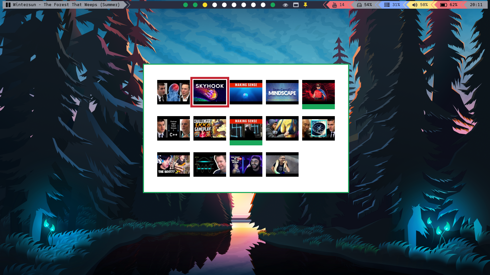

# SUBTUBE




Simple script that lets you watch videos from your subscribed channels without distraction of youtube page.

# Explanation
Whole idea came from realizing that [sxiv](https://github.com/muennich/sxiv) in it's thumbnail mode allows
you to select images the same way programs like rofi, dmenu, fzf, etc.
This makes it usefull as some sort of dialog.
Images contain *video id* in it's name so all you need is to play it via [mpv](https://github.com/mpv-player/mpv)
through [youtube-dl](https://github.com/ytdl-org/youtube-dl).
Screenshot above has my modified fork of [sxiv](https://github.com/muennich/sxiv) so it looks little different.

I rewrote this script with a lot of comments so feel free to fork and modify it to your liking

# DEPENDENCIES

This project has 4 dependencies and 3 optional ones. If you use arch or almost any normal linux distribution, this should be easy to get for you.

* [sxiv](https://github.com/muennich/sxiv) or [nsxiv](https://github.com/nsxiv/nsxiv)
* [youtube-dl](https://github.com/ytdl-org/youtube-dl)
* [mpv](https://github.com/mpv-player/mpv)
* [jq](https://github.com/stedolan/jq)
* ===
* [dunst](https://github.com/dunst-project/dunst)
* [xob](https://github.com/florentc/xob)

First 4 are core, last 3 are optional.
**Dunst** is simply notification daemon that is heavily used. If you dont install dunst, you still get some notification (because you probably have different one), but dunst supports images and stacking.
Without this dependency you wouldnt see any notifications, but it would still work. If you dont know what *notification daemon* means, you probably have it.
**XOB** is progress bar, if it's not installed then progress bar will be automatically disabled. Using `subtube update --secret` also disables the progress bar.

Script was rewritten to avoid bash dependency.
Use any POSIX compliant shell to run (like *dash* but *bash* will also suffice).

## Optional change
Recently, `youtube-dl` appears to be pretty slow.
As I have no idea why this would be the case, I leave this as default still.
If your buffering is slow, you should try `youtube-dl` alternative: [yt-dlp](https://github.com/yt-dlp/yt-dlp#installation).
You need to tell mpv to use it via mpv's configuration file (`$XDG_CONFIG_HOME/mpv/mpv.conf`).
Add this line to said file to switch (for me this one is WAY FASTER).
```
script-opts=ytdl_hook-ytdl_path=yt-dlp
```

## ARCH
on arch based distro, you can skip getting dependencies and install via [AUR](https://aur.archlinux.org/packages/subtube-git/) in [install section](#install).
```
sudo pacman -S sxiv mpv dunst youtube-dl jq
paru xob
```

## DEBIAN/UBUNTU

```
pip install --user youtube-dl
sudo apt install sxiv mpv dunst jq
```
Xob is not present on debian repo, install from source via link in *dependencies*. You will probably just need to run these commands

```
cd /tmp # or anywhere else if you wish to preserve repository
git clone https://github.com/florentc/xob
cd xob
make
sudo make install
```

# UPDATE
if script stops working one day for you, you need to update your youtube-dl
```
pip install --user --update youtube-dl
```


# INSTALL

Arch users can install from [AUR](https://aur.archlinux.org/packages/subtube-git/) with any [AUR helper](https://wiki.archlinux.org/title/AUR_helpers) (i'm using `paru`)
```
paru subtube-git
```

Or clone repository and install manually

```
git clone https://github.com/nagy135/subtube
cd subtube
sudo make install
```
These commands will clone repository and install executable to **/usr/bin**.

## UNINSTALL
removes all files created
```
sudo make uninstall
```

# USAGE

provides CLI interface via subtube (you might wanna check `subtube --help`)
```
subtube command
```
if ran without command, help is shown.
The optimal workflow you should try is to bind commands to key presses in key handler of your choice. I prefer this configuration:

Key press | command
--- | ---
super+y | `subtube play`
super+F5 | `subtube update`

## COMMANDS

### init
performs update but doesnt actually download any image. This is to fill your *seen database*.
You can skip this and run *update* instead.

```
subtube init
```

### update
reads subscribe list, downloads the newest 10 videos (if not seen yet) and allows you to play them (with play)
```
subtube update
```
or
```
subtube update --secret
subtube update -s
```
to avoid notification (I use it with [crontab 30 min interval](#crontab))

### play
brings up sxiv thumbnail selection, where (default sxiv bindings) **m** marks thumbnail and **q** closes it and starts playing all of marked videos (if any).
```
subtube play
```
or
```
subtube play --browser
subtube play -b
```
to play with browser instead.
Either specify with env variable (from env setting config like `~/.zshenv`) or manually like
```
BROWSER=google-chrome-stable subtube play -b
```
or let script try few popular options in random order

OR
```
subtube play --handler "google-chrome-stable --incognito"
subtube play -h "firefox --headless"
```
to play with custom handler. Each handler call wont block execution (ran in background).

### add
adds new subscribed channel.
This is link of channel's videos page (we parse that page so it needs to be videos tab)

```
subtube add "https://www.youtube.com/channel/UCYO_jab_esuFRV4b17AJtAw/videos"
```

### clean
gives you option to find and "mark to remove" old videos, where N means **at least N days old videos**. This brings sxiv selection to mark videos for deletion
```
subtube clean N
```

### newest
allows you to only pick from videos N minutes old (date when *subtube update* downloaded image). Very useful when you see notification but have many unseen videos to find it in.
```
subtube newest N
```


note that we use url of videos folder, not channel. This is because we find new videos by parsing page html (link has to point to videos folder!)

# MPV_HISTORY
Another script of mine [mpv_history](https://github.com/nagy135/mpv_history) can be used to replay video again.
Simply install it and subtube will populate it with records.

# SXIV integration
if you add following lines to your sxiv config (~/.config/sxiv/exec/key-handler) you will be able to show video title as notification or remove thumbnails.

After sxiv installation, create config folder and key handler script like this
```
mkdir -p ~/.config/sxiv/exec
touch ~/.config/sxiv/exec/key-handler
```

then add this content to the file (If this case statement already exists, so just copy 3 lines inside.)

```
#!/bin/bash

case "$1" in
    "n")      while read file; do subtube name $file & disown ; done ;;
    "l")      while read file; do subtube name_length $file & disown ; done ;;
    "r")      while read file; do rm $file; done ;; # remove thumbnail
esac
```
then make it executable
```
chmod +x ~/.config/sxiv/exec/key-handler
```

this allows you to use sxiv prefix (ctrl+x) followed by key inside quotes to perform additional actions

# CRONTAB
put these lines to you crontab file to download new thumbnails every 10 minutes.
There is little issue with this showing notification on some systems.
You might have to google a little to make it work.
But once your crontab can regularly spawn `notify send 'title' 'body'`, it will work and refresh new videos regularly.
If you can't `notify send` from crontab, it would simply update without notification.
```
*/10 * * * *  XDG_RUNTIME_DIR=/run/user/$(id -u) subtube update --secret
```

# BSPWM
i m using it on bspwm, so there is "one-shot sticky floating small middle screen" rule with notification if too many thumbnails to fit

# WAYLAND
My daily usage is currently on [wayland](https://wiki.archlinux.org/title/wayland).
If you use [xwayland](https://wiki.archlinux.org/title/wayland#XWayland) you should be fine but on [wayland branch](https://github.com/nagy135/subtube/tree/wayland) there are some wayland related changes. We also have **wayland AUR package** in [install section](#install)

# FUTURE WORK
* make repo of my "mpv history" script, that can play already played videos via rofi launcher
